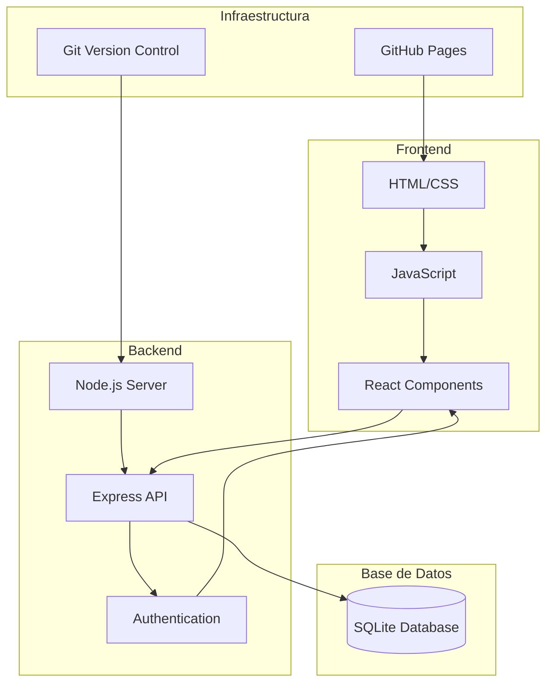

# 5. Arquitectura Técnica

## 5.1 Diagrama del sistema




## 5.2 Explicación técnica

### **Estructura de carpetas:**

```text
taskmaster-pro/
├── src/
│   ├── controllers/   # Lógica de endpoints
│   ├── models/        # Modelos de datos
│   ├── routes/        # Rutas API
│   ├── middleware/    # Middlewares
│   └── utils/         # Utilidades
├── public/            # Archivos estáticos
├── database/          # Configuración BD
└── tests/             # Pruebas unitarias
```

## 5.3 Tecnologías implementadas

### Dependencias principales:
- **express** – Framework backend
- **sqlite3** – Base de datos en desarrollo
- **jsonwebtoken** – Autenticación JWT
- **bcrypt** – Encriptación de contraseñas
- **react** – Librería frontend
- **react-dom** – Renderizado React
- **date-fns** – Gestión de fechas

### Dependencias de desarrollo
- **jest** – Testing
- **nodemon** – Recarga automática
- **eslint** – Linting de código
